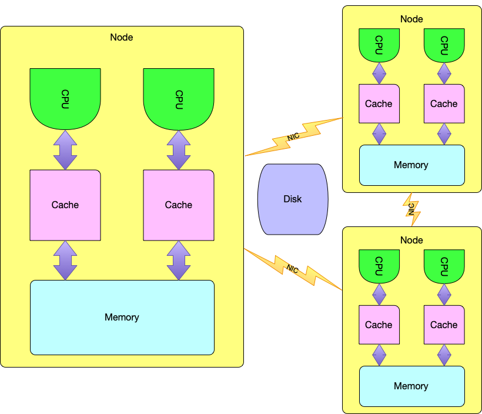

.. Parallel Programming documentation master file, created by
   sphinx-quickstart on Sun Oct 16 21:41:13 2022.
   You can adapt this file completely to your liking, but it should at least
   contain the root `toctree` directive.

.. toctree::
   :maxdepth: 2
   :caption: Contents:
   

Chapther 1: Introduction 
==================================================

Much is happening in the world of parallel programming. With the end of Moore's 
Law approaching and the problems we solve getting bigger, with greater amounts of
data, the need to solve problems using parallel techniques has never been 
greater. In writing parallel programs it is essential that we write code that 
scales well which means we have to be cognizant not only of the computational 
complexity of our code, but we must also think about how to write code without 
bottlenecks and with an awareness of computer architecture and how the choices 
we make impact the performance of our programs. 

This text will provide you with an introduction to parallel programming.
Important topics relating to both the big picture and the more subtle details of
parallel programming concepts and issues are presented here in a concise format.
There are many, many details that aren't covered in this text, but after reading
this and doing exercises that are introduced in the text, you will have an
introduction to the major issues and you will have seen enough examples to be
able to learn more about parallel computation and programming through further
study.

The text consists of ten chapters that each introduce a new topic while building 
on the material presented earlier in the text. Each chapter contains short 
questions and exercises that help to check your understanding and keep you 
engaged. At the end of each chapter are further, longer exercises to practice what
you learned in the chapter. When you have mastered a couple of the exercises at the 
end of a chapter, you should be ready to start the next one. 

This text assumes you have a basic understanding of Computer Science with an
introduction to programming in Python or Java and have had a Data Structures
course. The textbook doesn't just rely on this though. Chapters within the text
introduce C and Cython programming as well so the study of this text is somewhat
intense at times and there is certainly an expectation that you may need some
supplementary sources to help. Pointers to good sources of extra information
will be referenced in the text. There is an optional chapter on C++ programming
as well.

What Parallel Programs Can't Do
++++++++++++++++++++++++++++++++

.. _figcomplexity:

  Common Computational Complexity Plots

Computational complexity is the study of how programs perform as the amount of
data they process scales up. In :numref:`figcomplexity` you can see common
computational complexities graphed out for a visual comparison.

A good place to start is with confronting what parallel programming is not.
Parallel programming is not a solution to a poorly written program or an
intractable problem. For large inputs, you can't parallelize your way out of a
problem that isn't solvable in at least :math:`O(n~log~n)` time. For some small
quantities of data, parallel algorithms with :math:`O(n^2)` or worse
complexities will run faster, but they cannot scale to large amounts of data.
Anything :math:`O(n^2)` or bigger won't scale and would only be solvable for
small, trivial, toy problems.

A parallel application does not change the computational complexity of its
algorithm. Parallel computation, like sequential computation, is measured in
terms of how the time for running it scales as the data scales. Said in another
way, the speed up of parallel computation is measured in a constant, divided by
the sequential parallel computation which does not affect the computational
complexity at all.

.. math::

   O(sequential(n) / constant) \equiv O(parallel(n)) \equiv O(sequential(n))

The constant can be pretty big, but it is still a constant. For instance, the
Frontier supercomputer of Oak Ridge National Laboratory contains 9,408 CPUs,
each with a capacity of 64 cores. In addition, there are 37,632 GPUs for doing
floating point calculations. Without the GPUs being factored in, that's 602,112
cores. Each core supports 2 threads simultaneously, so that comes to 1,204,224
possible active threads of control in an application. The constant speed up
possible from a sequential application to a parallel application that does the
same computation is bounded by these numbers on Frontier. 

While theoretically it would be possible for a sequential application to speed
up by 1,204,224 when run on Frontier, it would take a very special program that
is *embarrassingly parallel*. This is a technical term that describes a program
that has no dependencies on what other parts of the program are doing. No
*synchronization* or *communication* is necessary in an *embarrassingly
parallel* application. Other than silly example applications, these kind of
applications don't exist in the wild.

All interesting parallel algorithms must communicate their results at some
point. They may also need to wait to compute their results until some action or
event occurs. Parallel applications need to *communicate* and *synchronize*. All
communication and synchronization in a program reduces the potential speedup
that parallel computation provides. At one extreme we have the *embarrassingly
parallel* algorithm. At the other extreme we have an application that needs to
be in lock step throughout its run, in which case it is not parallelizable. 

The trick/skill in parallel programming is to discover those parts of a program
that can be independently computed and to minimize the need for
*synchronization* and *communication*. But, the lesson in this section is that
no matter how well you master this skill, the Computational Complexity of your
algorithm will not change by parallelizing it. It will only improve by some
constant factor. Nevertheless, that constant factor of improvement, might be the
difference between getting some work done in a year or getting it done in
1,204,224 years. You can see why we might be interested in parallelizing
applications!

So there are two primary reasons to parallelize an application. We just mentioned 
one reason: we can get the work done faster. The other reason to parallelize an 
application is to allow it to run on larger datasets. The motivation may be a 
combination of the two as well of course. Scaling and speed are the two primary 
reasons to parallelize applications. 

In the next section, we'll look at some applications from the world of supercomputing 
to better understand the types of problems that benefit from parallel computation. 

Parallel Applications
++++++++++++++++++++++++

So what kinds of problems are solved by parallel algorithms? Really any problem
that can be divided into independent parts and then perhaps uses those
independent results to arrive at a final result. Sometimes people want to run
many instances of a program in parallel in what is called an *ensemble*
calcualation. In *ensemble* computation a program is run more than once because
there is some statistical nature to the calculation and running more than one
instance helps to determine an optimal solution. At other times a parallel
computation just divides up a really large dataset into small quantities because
they can then be solved in a reasonable amount of time and the results can be
stitched back together. Let's consider some real life examples.

Nuclear Fusion
----------------

A
`tokomak <https://www.energy.gov/science/doe-explainstokamaks#:~:text=The%20world%20record%20fusion%20power,largest%20superconducting%20magnet%20ever%20built.>`_
is a device that shows promise to contain hot plasma that one day may create a
sustained nuclear fusion reaction. In pursuit of clean, unlimited energy there
are many experiments being conducted at a few places in the world. These
experiments, including the
`K-Star Tokomak <https://www.newscientist.com/article/2336385-korean-nuclear-fusion-reactor-achieves-100-millionc-for-30-seconds/>`_
:cite:p:`kstar-rpt`, gather large quantities of data that must be analyzed to
see how they might modify the tokomak for the next experiment. Time between experiments
is critical when running the tokomak. Data analysis must be fast to give scientists maximum feedback with minimal wait. Parallel 
computation is of the utmost importance :cite:p:`kstar-delta`.

Covid-19
-----------

`HPC Wire <https://hpcwire.com>`_ is an excellent source of news in the world of
supercomputing. The website has a dedicated site to just the
`fight against Covid-19 <https://www.hpcwire.com/2021/03/09/the-history-of-supercomputing-vs-covid-19>`_
and all supercomputing news related to the disease.

CFD Simulations 
----------------

In the world of Physics and engineering, understanding the world around us often
involves running simulations. Simulations are corroborated with observational
data to validate their results. The simulation itself helps us understand how
something happened. For instance, Computational Fluid Dynamics (CFD)
applications are widely used to perform fluid flow simulations. Consider the
flow of air over an airplane wing. A simulation helps predict how air will
behave given the construction of the wing. Rogers, et al., wrote an interesting
paper describing the challenges in writing a CFD for this purpose
:cite:p:`Rogers-2000`. This paper is interesting because it was written during
the transition from vector processor supercomputing to today's distributed
supercomputing. The paper provides a little insight into the challenges of and
optimizations for both architectures and mentions some early distributed
computing libraries that were used in distributed supercomputing.

Magnetohydrodynamic (MHD) simulation focuses on understanding how electrically
conducting fluids behave. MHD solvers are specialized versions of CFD solvers.
The concept of electrical current also applies to gravitational properties in
astrophysics. One such application, the Wombat application was written as a
scalable MHD application :cite:p:`Mendygral_2017`.

AI 
-------

What is AI? It seems that AI is really all about problems we don't understand
well. When we finally have a good grasp of how to solve a problem, it isn't 
AI anymore. Recently, the problem has been Machine Learning which presently about 
training a model to recognize a pattern and then respond with an expected outcome
from its observation. So AI has become training these models to get the 
expected outcomes from them. Actually running the model later on a real set of 
new inputs isn't that interesting. It is rather mechanical.

Getting input data, sampling input data, preparing the data for model training,
and model training itself are all tasks that can be parallelized. Consider the 
Alpha Zero program. Andrew Young has an excellent article on how they parallelized 
some of the Alpha Zero training :cite:p:`Young2018`.

Chapter Summary
++++++++++++++++++

This chapter introduced parallel programming from an application perspective and 
provides perspective on what parallel programs cannot do. A parallel version of an 
application does not overcome a bad computational complexity. Parallel programs can 
speed up a sequential non-parallel program only by a constant factor. Parallel versions 
of programs also enable programs to run on bigger data sets than may be achievable with 
sequential versions since the data is often distributed over many nodes. 

In addition, the chapter introduces several types of HPC applications like Machine
Learning and CFD simulations includes some real life examples of those applications. Machine 
learning and CFD simulations are common types of applications. 

Review Questions
++++++++++++++++++

These are all short answer questions, but require more than one word answers. Answer 
each question with a short paragraph.

#. Explain what a CFD application is. If you do a bit of resarch, you can
   describe the details of such an algorithm in a bit more detail than is provided
   in the text.

#. If a sequential program is rewritten as a parallel application and the
   sequential version takes *X* time to execute, how fast will a parallel version
   of it be? The point of this question is for you to qualify your answer with some
   comments to demonstrate your understanding of what parallel programs can and
   can't do.

#. What were the lessons learned by the Alpha Zero project? Name at least three lessons.

#. In the struggle to control the Covid-19 pandemic, what were three contributions that 
   were made possible by supercomputers? Write a short paragraph for each
   contribution summarizing the result and provide references for your summary. 

#. This will require a bit of research. What computer system is slated to help with the 
   Iter Fusion work? What are some facts about this system that would be
   interesting to share?

#. What supercomputers are on the Top 500 top 5 right now? Include companies and a three 
   interesting facts about each system. 

Chapter 2: Computer Architecture
==================================

.. _arch:

  Computer Architecture 

To understand how to parallelize and get the most out of performance, it is best
to know something about computer architecture. There are many architectures and
designs that differ in technical details. Fortunately, the differences are quite
technical while much of computer architecture has standardized around some
common elements. In this chapter we'll explore those common elements, how they
work, their limitations, and how to get the most out of them in your parallel
programs.

This is not meant as a complete introduction to either operating systems or
computer architecture. Rather it concentrates on aspects of both operating
systems and computer architecture that can affect the performance of programs on
a system. This is intended to make the reader aware of the design and
implementation of these abstractions and hardware. The goal is to provide the
background to make wise choices when writing parallel programs and to understand
other related concepts that are not covered in this chapter. We'll start by
talking about processes and how they are executed on a system.

Multitasking and Multiprocessing 
+++++++++++++++++++++++++++++++++

.. _multitask:

.. figure:: images/multitasking.png

  Multitasking in the OS

All modern operating systems support *multitasking*. Multitasking is an
operating system feature where more than one process may be *active* in the OS.
On CPUs with only one core, which used to be the case, the set of active
processes were each given a timeslice for a very short amount of time, generally
a few milliseconds or less. The appearance to the user was much like looking at
a flip book for animation. It appeared that all the active processes were
running in parallel, which really wasn't the case.

Many processes are waiting on I/O when they are executing. A multitasking
operation system will take advantage of that by not giving a timeslice to
processes that are waiting on I/O. Instead those processes are suspended by the
OS until the input can be read or the output can be written. We call this
blocking I/O because it blocks the process doing it until the I/O is complete.

The set of processes that are actually running is called the *active set* and
the *OS scheduler*, which is one of the active processes, scheduled processes in
a round-robin fashion, making sure that all active processes get a timeslice to
make them appear to keep running.

*Multiprocessing* is when there is more than one core in the CPU or CPUs
connected to the memory and other components of a computer. Multiprocessing is
supported by the CPU and it is not an OS feature. However, support for
multiprocessing must be a part of the OS for the computer to take full advantage
of it. In a multiprocessing system more than one process is running at the same
time. The scheduler then as multiple processes all executing timeslices before
the OS switches to the next. Nothing changes in :numref:`multitask` except
that more then one process is active at any point in time.

.. _Frontiernode:

.. figure:: https://docs.olcf.ornl.gov/_images/Frontier_Node_Diagram.jpg

  Frontier Node Architecture 

Many of the motherboards today for high-performance computers support two CPUs.
They have two sockets in which to seat a CPU. One CPU may have 64 cores. So
there are 128 possible cores on high-performance computer nodes. When talking
about a supercomputer they are called nodes. An Intel innovation called
Hyperthreading actually allows for two threads to execute per core. There are
some limitations to what that actually means, but it still effectively doubles
the amount of work that can be parallelized per core. Other manufacturers, like
AMD, have similar technology. While two sockets are possible on some boards, the
Frontier supercomputer has just one
`CPU per node coupled with four GPUs <https://tinyurl.com/4px3dkz8>`_ as shown 
in :numref:`Frontiernode`.

Hyperthreading means on high-performance nodes you can run up to 256
processes/threads simultaneously which would be great if you could achieve that.
This is called a theoretical maximum. It cannot be achieved, but ideally it
would be nice. On Frontier there are 128 processes possible but that must be
coupled with the work that can be carried out by each of the 4 on-node GPUs.

Processors can run more threads/processes than are simultaneously possible. In
that case, multitasking becomes important since there may be more than 256
processes in the active set and the scheduler will keep them moving by switching
between them. However, when there are more processes than can run
simultaneously, we say the CPU(s) have become *over-subscribed*.
Over-subscription can be a cause for *thrashing*. Thrashing occurs when
switching between processes is taking more of the resources of the computer than
the actual work getting done. You want to avoid over-subscription if possible.

Multitasking can slightly speed up a program's execution because we can do work 
on another process while others are waiting for I/O. Multiprocessing is where 
we make bigger gains. We want our parallel programs to execute as much work in 
parallel as possible and multiprocessing OS's make that possible. 

Pipelining 
++++++++++

.. _pipeline:

.. figure:: images/pipeline.png

  The MIPS pipeline

Instructions for CPUs are data and they are stored in the memory of the
computer. That was one of the things John von Neuman :cite:p:`neumann`
contributed to the young field of Computer Science. All modern computers are
built around this von Neumann architecture.

Machines built around this fundamental principle execute instructions by first
fetching them from memory, then they decode those instructions, then they
execute them. These steps are repeated for each instruction in a program,
sometimes more than once. This repeated fetch/decode/execute is seen as a loop
and is called the fetch/decode/execute loop.

CPUs coordinate their execution of these stages in a CPU around a clock. An
internal clock ticks and on each tick (i.e. cycle), a new stage of the
fetch/decode/execute loop completes. The clock cycle coincides with internal
circuitry that allows results to be written to memory locations either in memory
or in hidden internal memory in the CPU.

In the 1990's hardware architects like Patterson and Hennesey
:cite:p:`Patterson1998` saw that they could define a couple more stages to the
fetch/decode/execute loop and place internal registers between the stages of
execution to allow one instruction to be in each stage of execution
simultaneously. When an instruction completes a stage, it writes its results for
that stage into the pipeline register that appears after its stage in
:numref:`pipeline`. Then it immediately starts working on the next instruction
in the previous pipeline register, or in the case of the fetch stage, a fetch is
executed on memory to get the next instruction. This is called *pipelining* in
the CPU, or *pipelined* execution.

Sometimes the pipeline is disrupted. This occurs when an if-statement or loop is
executed which results in executing a jump instruction in the CPU.
Knowing which instruction will be next is not possible all the time in those
situations. When that occurs, the CPU figures it out in the decode or execute
stages. In that case, the instruction has not had any side-effects yet, so it
can just be discarded and any errant instructions behind it are also discarded
and the next fetch will be from the right location, which restarts the pipeline.

Pipelining leads to a three to five-fold speedup of execution. We want to avoid 
writing code that restarts the pipeline if possible. There are some techniques 
that compilers employ to help with this in high-performance code. One of those 
techniques is called *loop-unfolding* where a loop's code is repeated some number 
of times rather than jumping back to the start so the pipeline doesn't get 
restarted as often. 

Caching
++++++++

Effective pipelining of code relies on the CPU being able to fetch an
instruction on every cycle of the CPU. In addition, if the pipeline is
disrupted, it is important to begin fetching the right instruction as soon as
possible to avoid disrupting the pipeline any longer than necessary.

At odds with these needs is the architecture of memory. A general rule of thumb
is the bigger then storage device, the slower the device operates for storage
and retrieval. A CPU has very limited storage. Memory can hold Gigabytes of
space. It cannot be written to or read from as fast as the CPU can execute
:cite:p:`WikiMem`. Memory operates on the clock cycle like the CPU. On a 1000GHz
system the clock cycle is 1 ns. Memory referred to as DDR3-2000 takes 7 clock
cycles from when you supply the address to when the data is available. With DDR4
it is 4 cycles to read data :cite:p:`verilog`. A write to DDR4 memory needs 5
cycles to complete. To keep the pipeline running smoothly, a smaller and faster
memory, between the DDR RAM and the CPU is employed. This smaller, fast memory
is called a cache. Caches appear frequently in computer architectures. The cache
between memory and the CPU is one type of cache.

Cache Types 
-----------

In fact there is more than one cache between CPU and memory. One level of cache
feeds into another. These two levels are called level 1 and level 2 cache. L1
cache resides on the CPU itself. L2 cache is typically separate from memory and
the CPU and fits between L1 and the DDR RAM. L2 cache is bigger (and hence
slower) than L1 cache.

Caches hold copies of data in memory. When data is read or written by the CPU it
is read from the cache and written to the cache. The goal is to always have the
data in the cache that needs to be read. Since caches are smaller than the main
memory of a computer, the computer hardware must choose which memory to have in
the cache.

In addition to different levels of cache, there are also separate caches for
instructions and data. Data cache is where the data of a program is copied.
Instruction caches are used by the CPU in fetching instructions.

And finally, recall that motherboards may have more than one socket which allows
more than one CPU to be installed. With two CPUs there would be two data caches
and two instruction caches, one for each CPU. This includes both on chip L1
cache and L2 cache between the CPU and the DDR RAM.

Instruction and Data caches may be tuned differently. This text covers only the
fundamentals of caching as they apply to high-performance computing and is not
meant to be a complete discussion of their design or implementation.

Direct-Mapped and Associative Caches
--------------------------------------

.. _directmapped:

  Direct-Mapped Cache

The RAM of the computer is designed as one long continuous array of bytes. Each
byte has a unique address so that all bytes of the RAM are randomly accessible,
which means we can read from or write to any byte of memory in O(1) time, even
though it takes a few cycles to complete.

While not shown in the picture in :numref:`directmapped`, caches store blocks of
data of some block size. Typically in modern computers this block size, called a
*cache line*, is 64 bytes :cite:p:`igoro`. Since 64 bytes can be read in about
the same number of cycles as one byte, reading the extra data helps with
efficiency in the cache by taking advantage of *spatial locality* in a program.
Spatial locality refers to the fact that data near other recently accessed data
is more likely to be needed in the near future than other data.

Caches are not the size of RAM, yet have copies of RAM in them. Because they are
smaller, a cache not only stores the data, it also records the address where
that data resides in RAM. The organization of cache memory might be what is
called direct-mapped cache. In direct-mapped caches, there is one location in
the cache where a cache line can be stored. More than one 64 byte block of RAM
maps to the same block within the cache, but the cache can only hold one of
those blocks, or cache lines, at a time. For instance, in a 32K cache, the 64
bytes at address 0 would be direct mapped to the same 64 bytes in the cache as
the data at address 32K, 64K, 96K, and so on in the RAM.

.. _assocmem:

  Fully-Associative Cache

On the other extreme some caches allow cache lines to be stored anywhere within
the cache memory. This type of cache is called associative memory. It features
hardware parallelism when looking up a value in cache and is therefore more
expensive. All entries are searched in parallel by the memory itself and a match
on the address returns the corresponding value in a fully-associative cache
memory.

There are also caches that are a combination of direct-mapped and associative. 
Cache implementations have an impact on how long and how likely it is that a program's 
data will be in the cache when it needs it. But no matter what the implementation, it 
is always possible to write a program that does not play nicely with the cache.

For instance, consider a program where you have an array and need to loop over
that array or list in your program. If you write a loop that has a step size of
64 bytes or more, then you are accessing data from different cache lines on each
iteration of that loop. This can cause you to read one item out of a cache line,
then throw it away only to want it again later. Depending on the overall size of
the cache, this may not work well with your cache.

If instead your program might be rewritten to loop over the contiguous elements in
order, the cache would likely be much less overwhelmed which would result in a
higher probability that the data your program needs is already present in the
cache.

There is a whole study of what are called cache-replacement algorithms in
associative memory. Least Recently Used (LRU) and Not Recently Used (NRU) are
two such cache replacement policies. The goal of any replacement strategy is to
maximize the *hits* on the cache (i.e. when a needed value is already in the
cache) and mimimize the *misses*. Each of these algorithms exploit some aspect
of *spatial* and/or *temporal* locality of data.

Knowing something about caching can help in optimizing code to get the best 
performance possible. This is especially true in programs that loop over 
data that is organized in some contiguous fashion. That's when there is a 
bigger chance that a cache will make a difference in execution time of a 
program. Being aware of choices like how to organize data will lead to 
better *cache friendly* code. 

Writing Values
-----------------

When the CPU writes a new value to memory, the cache must also be updated if it
contains a copy of the memory being written. Typically the CPU writes the new
data to its data cache and it up to the cache to send the new value out to
memory. Writing the value back to RAM can be done immediately when it is written
to the cache. This is called a *write-through* cache where data is written to
the cache and the write goes through immediately. The issue here is that this
doesn't take advantage of spatial locality in the program.

The other possible write policy is called *write-back*. A write-back cache does
not update the RAM of the computer until the block is about to be discarded
because the cache line is being used for a different memory block. In this case,
the cache line is *dirty* and needs to be written to RAM before it is discarded.

Because there can be two or more data caches on a system, when one cache is written 
to by a CPU it means that the other cache, if it has a copy of the same block, has 
an invalid copy. To handle that one cache can signal to other caches that the block 
is invalid via a cache coherence protocol :cite:p:`WikiCoherence`.

Cache coherence refers to the fact that all caches and memory on a computer should be 
in sync in terms of their contents. If you don't have cache coherence on a system then 
special steps may need to be taken to guarantee that you can count on the values you are 
using in your parallel program. That may sound a little scary, but it is less of a problem 
than you might think in general. Mostly this comes into play when trying to synchronize 
between processes and usually that is under some very strict rules. 

Atomicity 
+++++++++++

Parallel programs sometimes need to sychronize between their processes or
threads. That synchronization typically occurs in memory that is shared between
the processes or threads. We have seen that caches introduce copies of RAM to
increase the system performance by placing data closer to the CPU in smaller,
faster memory. But the introduction of caches also introduces copies of data. In
addition, operations might think are safely executed in one step probably are
not. Firstly, pipeline processors execute instructions in multiple steps by 
design. But also, something as simple as adding one to a variable is not 
necessarily done in one step. 

Operations that can be performed in one step are called *atomic* operations.
Atomic operations were so named because the atom used to be consider
indivisible. Atoms were the basic building block of matter. While we know that's 
not true now, we still use the name. 

There is a need for atomic operations in a computer. These atomic operations are
called *atomic instructions* and CPU architectures generally support some set of
atomic operations. In the C language we have access to these atomic
instructions. For example, there is a fetch_add instruction that fetches a value
at a memory location before adding one to the value at that location.

There is quite a lot that happens when an atomic instruction executes. For
instance, the cache of a program that contains a copy of the memory being
updated, has that cache line invalidated so that it must be fetched from memory
again before it is used by the CPU. Atomic instructions are guaranteed atomic
across ALL the CPUs and cores of a system. Later, when C programming is
introduced we'll revisit atomic instructions.

Virtual Memory 
++++++++++++++++

.. _virtualmem:

  Virtual Memory Snapshot

All modern Operating Systems and CPUs are 64-bit. The 64-bits refers to the size
of a pointer on the system. A pointer is an address of a byte in the RAM of the
system. Well, almost. There are multiple processes executing on a system, either
through multi-tasking or multi-processing or both. To protect these processes
from each other, each process has access to it's own 64-bit address space.
Sixty-four bit pointers means that a single process can access 16,384 Petabytes!
That's not going to happen any time soon. Instead, a process is allowed to
access areas within this immense address space. These areas are called pages.
The address space is split into pages and a process accesses its data and
program instructions in pages. While page sizes may vary between operating
systems, a typical page size is 4K.

Operating Systems (i.e. OS's) and CPUs work together to support what is called 
virtual memory. When a process is running, any pointer access to RAM is first 
translated via what is called a *Translation Lookaside Buffer*. This TLB translation
translates between a virtual memory 64-bit pointer to a real RAM address.

Virtual memory allows for pages to be written to disk when they are not needed.
This is because the RAM is not big enough to hold all the programs and data for
all processes executing on the system. So, resident pages are replaceable and
the TLB is updated when one page is written to disk while another is loaded into
RAM.

The cool thing is that this all works without your knowledge because it is
transparent to the user. However, there are a couple things to note in passing.
Pages that are needed in RAM and are currently on disk get *swapped* into main
memory when they are needed. The operating system does this automatically and it
is called a *page fault* when the virtual address in the TLB is found to be
currently stored on disk. The virtual address page is then brought into the RAM
and potentially replaces some other virtual address page that is currently in a
physical, resident page of the RAM. 

Page faults are bad for HPC applications because they are very slow in
comparison to accessing RAM. In other words, disks are much slower than RAM.
Once again the bigger the size of data that can be stored, the slower it is.

When a CPU becomes over-subscribed, meaning it is too busy, there are more and
more page faults that are generated. This can lead to the computer mostly doing
page faults to bring into RAM the *working set* of pages a process needs to
execute. When page faulting is happening so much that little other work is being
accomplished we say that the system is *thrashing*. When writing parallel
programs we don't want to create situations where the system is thrashing. So,
we likely have to keep track of how many processes are executing and how much
memory they are using to avoid this situation. We don't want to over-subscribe
our computer.

Some pages, like the OS pages in :numref:`virtualmem` may be *pinned*. A pinned
page is one that is permanently in RAM. It will still have virtual memory
addresses, but it cannot be written to disk. It is possible for user programs to
pin pages, but doing so must be done sparingly since pinning too much RAM can
lead to thrashing as well if too little memory is left for other processes.

NUMA 
+++++

NUMA, or non-uniform memory access, refers to motherboards that support more
than one CPU socket. In these configurations, to allow faster access to memory
by more than one CPU, the memory may be physically split into *nodes* or *zones*
where one zone is close to one CPU and another zone is closer to another CPU
:cite:p:`numa`. The zones and CPUs (and their cores) are connected via an
interconnection network on the motherboard. That interconnection network
provides fast access to the CPU closest to its zone, but also enables access at
a slower speed from the other CPU socket.

.. _crossbar:

  A Crossbar Interconnect

There are many different connection topologies that are possible. A cross-bar
switch would provide simultaneous access to all cores and memory zones. NUMA
systems do not have crossbar switches because they are relatively expensive and
because they don't scale well. Crossbar switches grow at a :math:`O(n*m)` rate
where *n* and *m* are the number of end points. In :numref:`crossbar` everywhere
two wires cross is the location of a switch and it is the switches that grow at
the :math:`O(n*m)` rate. As they grow at this rate, so does the failure rate.
Growth concerns in the interconnect isn't just expense. It is also the rate of
failure, power requirements, cooling requirements, and just the motherboard or
chip real estate. There are many, many problems with architectures that don't
scale well.

.. _numaint:

  A NUMA Interconnect

Instead of a crossbar interconnect, other interconnects are possible that
provide the NUMA access to memory without the growth we see with a crossbar
interconnect. For instance, without getting into too much detail,
:numref:`numaint` shows how two sockets on a motherboard might be connected to
two memory zones. In this topology, each transit through a switch (the yellow
*S* boxes) takes a unit of time. So, traveling to the local memory zone takes
just one hop, while to the other zone it takes two hops or twice as long. Both
CPUs can still access all the memory on the system. It just takes twice as long
to access a non-local memory zone. This topology conforms to the data gathered
by using the Linux command ``numactl --hardware`` in :cite:p:`numa`.

NUMA organization means that there may be some advantage to an HPC application
to have processor and data *affinity* which can help control where data and
processes are placed to maximize performance.

Distributed vs Shared Memory Computing
+++++++++++++++++++++++++++++++++++++++

So far this chapter has concentrated on architectures that support shared memory
high-performance computing. Sharing memory between processes means that
synchronization and communication primitives based on POSIX system calls and
atomic instructions are possible. But, there are several issues with scaling up
the number of processes on a single, shared memory node.

One of the biggest issues is the number of cores available on a node. While
motherboards may have multiple sockets, the total number of cores is a rough
upper bound of the total number of processes that a node can support. It is
possible to run more processes than cores, especially when those processes are
I/O bound, meaning that they are often waiting on some external event or data
before they can do their work. But at some point, the number of processes that
want to run exceeds the number of available cores and the processor is
over-subscribed, meaning that no further performance gains will be realized by
adding processes. In fact, adding new processes will have a detremental affect
on performance due to the overhead of task switching and potential page swaps
which consume additional cycles.

Another issue can arise even before a processor becomes oversubscribed. If all
processes are accessing memory with both reads and writes, then caching becomes
less effective. High performance DRAM memory can only support two to four reads
simultaneously and up to two write locations depending on the system
architecture. Of course, more writes and reads are supported, but not
simultaneously by the memory. The system handles this by delaying simultaneous
reads and writes. Since reads and writes take multiple clock cycles, a delayed
read or write will wait until it can access the memory by stalls in the
pipeline. This is why caching is so important and when caches fail to get a
*hit* the stall will delay execution of the program. At a certain point, the
number of processes concurrently executing on a node will begin to increase the
number of stalls in the instruction pipelines.

Having access to shared memory is desirable and shared memory parallel programs
will have better performance than diststributed memory versions of programs when
the computer on which the program is running is not oversubscribed or
experiencing a large number of read and write conflicts. Primarily
oversubscription is the concern. To get better performance, it will be necessary
at some point to go off-node. When a parallel program runs on more than one
computer or node, it is a distributed parallel program.

Distributed parallel programs must communicate via message passing. The message
passing might be hidden from the programmer in the case of using a library like
SHMEM. Or it might be handled entirely by the programmer using something like
socket programming. To get the best performance, it is best not to hide the
underlying performance characteristics of the hardware since that sort of
library takes the decision making out of the hands of the programmer.

Consider the SHMEM library. It provides an abstraction of shared memory, but
across nodes. When programming SHMEM applications the underlying hardware
architecture is hidden behind the SHMEM abstraction. This impacts the desired
performance of SHMEM applications. Remedies were suggested, including a mixture
of MPI and SHMEM :cite:p:`WikiSHMEM`, which suggests that SHMEM by itself did
not have enough information to get the desired performance from a distributed
parallel application.

The art of parallel programming is designing an algorithm that scales and
performs well both on-node and off-node. It is up to the programmer to choose
relevant libraries, to understand how these libraries scale, and to use them
effectively and efficiently to solve problems. We'll dive further into these
design choices in future chapters.

Interconnection Networks 
+++++++++++++++++++++++++

Distributed applications must run over a network between nodes. A standard
ethernet network suffices for many clusters. A cluster is simply a collection of
nodes that are networked, usually by a local ethernet network. It might be the
case that such a local network is a collection of high-speed network interface
cards (i.e. NICs) connected to high-speed switches. The goal of any such network
is to minimize latency and provide good bandwidth.

Latency is the time it takes a message to be transmitted from one point to
another. Round-trip latency, sometimes called ping-pong latency, is a common
measure of latency in the network and can be measured by a simple ping-pong
test. Latency is important to minimize since it is a measure of how fast
messages can be transmitted between nodes in a cluster.

Bandwidth is a measure of how many bytes can be transmitted in a unit of some.
It's usually measured in bytes per second. Bandwidth in a parallel application
is important when distributing larger amounts of work from one node to another.
It is a measure of how much information can flow between two nodes at anyone one
time and may involve multiple processes especially when multiple NICs are
available.

The network interconnect becomes very important in today's supercomputers.
Supercomputing has evolved to be synonymous with high-performance distributed
computing. Each node in a supercomputer is typically a high core count node,
usually with access to at least one GPU. :cite:p:`WikiFrontier`. The Frontier
system has four GPUs per node. While each node is powerful in itself, the
problems today's supercomputers are solving require coordination of multiple
nodes running on parts of the data of large problems, whether it's AI related or
a simulation-based parallel program.

The interconnection network is extremely important to the overall performance of
these distributed parallel programs. While standard NICs will work,
supercomputers like Frontier employ several advanced NICs per node. Frontier's
Cassini NIC is fast and capable of advanced data movement primitives to improve
both latency and bandwidth :cite:p:`CassiniSlingshot`. Together with the
*Rosetta* switch, the *Slingshot* interconnect is the current premiere
interconnect in the HPC world given that exascale flops has just recently been
achieved and verified for the first time. There are other examples of fast
interconnects. Any company that wants to compete in the HPC space needs an
interconnect to connect the distributed nodes in their system. For instance,
NVidia's interconnect is Infiniband.

Like all things in HPC computing, interconnects must scale and cannot create
bottlenecks. The reason that Slingshot is the premiere interconnect has a lot to
do with the fact that it can scale and support adaptive routing and congestion
control to avoid network bottlenecks :cite:p:`CassiniSlingshot`,
:cite:p:`Slingshot`.

As parallel programmers we need to be aware of that our code runs in a
distributed network of nodes. Much of the actual low-level communication is done
by libraries since programming the actual inter-node communication is a complex
problem. Later in this text we'll explore some of those libraries that help
manage off-node communication as one aspect of parallel programming.

Chapter Summary
++++++++++++++++++

This chapter introduced many concepts in single node computer architecture. The
architectural components introduced in this chapter help inform decisions
concerning the design of parallel programs. It's not the case that every one of
these concepts has to be remembered all the time, but understanding the
characteristics and limitations of the hardware can help with setting reasonable
goals and expectations for parallel programmers. And, when things aren't working
as expected, having some basic understanding of the hardware can aid in
developing theories and solutions to those problems.

Review Questions
++++++++++++++++++

These are all short answer questions, but require more than one word answers. Answer 
each question with a short paragraph. 

#. What is the difference between multitasking and multiprocessing? 

#. What does the scheduler of an operating system do? 

#. How can a processor run more processes than it has cores? There are two
   answers to this question.

#. What is thrashing and is that something we want to avoid or try to attain?

#. What is a pipeline in computer architecture? How does it speed up the exeution 
   of programs?

#. In terms of the pipeline, why are jump and branch instructions a bad thing?

#. How can loop unfolding help increase program performance?

#. Caches have hits and misses. Explain these two terms. 

#. Why are caches important to program performance?

#. What is a cache line? How does that term relate to performance of a program?

#. How can each process in a computer or node have access to way more memory than the RAM of the 
   computer? What mechanism makes this possible? Explain with a short paragraph.

#. What makes it possible for a process to reliably synchronize with other processes running on the 
   computer? Can you think about how two processes might synchronize with each other to work together 
   to count to 100? 

#. What does NUMA mean in terms of memory access from your program?

#. How does distributed computing differ from on-node computation? What does the
   distinction mean in terms of your program?

#. What is Slingshot? What is its topology? Why is it one of the premiere
   interconnects available today?

.. include:: chap1.rst

.. Chapter 3: Python Programming 
.. ===============================

.. Virtual Machine 
.. ++++++++++++++++

Chapter 4: Threading
================================

This chapter explores hardware organization of program execution. Specifically,
it concentrates on the threading model of execution. However, many of the
principles of multi-threaded applications apply to multi-process parallel
programs as well. The chapter will briefly point out differences to be further
explained in subsequent chapters. Java has a nice threading library. Python, C,
and C++ also include the ability to write multi-threaded programs. In a certain
sense, multi-threaded programs are the easiest parallel programs to write. But
that ease of programming is also a hindrance as well. The rest of this chapter
will elaborate to provide you with some multi-threading skills and knowledge of
the strengths and weaknesses of multi-threaded programs.

In this and subsequent chapters, it may be useful to plot the running time of
various implementations of code. While there are many ways to plot data, the
`plot program <https://kentdlee.github.io/CS2Plus/build/html/chap2/chap2.html#computational-complexity>`_
downloadable from this link is useful in quickly viewing plots. The referenced
page provides the plotting program, called *PlotData.py*, and a sample program that
demonstrates how to create a plot data file.

The Run-time Stack and Heap
++++++++++++++++++++++++++++

.. _memorg:

  Memory Organization of an Executing Program

All modern programming languages organize memory as pictured in
:numref:`memorg`. Alan Turing, at the dawn of electronic computing determined
that programs could be stored in the memory of the computer, like the data that
the program operates on. The term stored-program computer was born.

In the late 1950's to around 1960, IBM developed the first modern programming
language, Algol 60 :cite:p:`algol60`. It supported nested functions and
recursion. Nested function definitions are largely possible due to scoped
references in a programming language which is not a parallel programming
concept, but can be used in parallel programs. To support recursion and function
calling in general, a run-time stack is required. Each time a function is called
a stack frame is pushed onto a run-time stack which holds the local variables of
the called function along with state information about where the program is in
the execution of that function. When a function returns, its corresponding stack
frame is popped from the run-time stack. In a parallel program, every thread or
process has its own run-time stack.

When a program creates data or an object *dynamically* it is creating an
allocation on the heap. In a multi-threaded program, the heap is shared between
all the threads of the program. This makes it very convenient to share data
within a multi-threaded program. However, it also means that all threads must be
co-located on the same node or computer. Threading relies on shared memory in
the application. 

Static data refers to data that is statically allocated and is used for storing
globally accessible data within a program. Typically statically allocated data
is used for storing constant values in a shared memory program. It can also be
used to store a single instance of a variable. Static data is shared between
threads.

A First Thread Example 
++++++++++++++++++++++++
   
.. code-block:: java 
   :name: threadex1
   :caption:  A First Thread Example named ThreadTest.java 
   :linenos:

   class RunnableDemo implements Runnable {
      private Thread t;
      private String threadName;
      
      RunnableDemo( String name) {
         threadName = name;
         System.out.println("Creating " +  threadName );
      }

      @Override
      public void run() {
         System.out.println("Running " +  threadName );
         for(int i = 20; i > 0; i--) {
            System.out.println("Thread: " + threadName + ", " + i);
         }

         System.out.println("Thread " +  threadName + " exiting.");
      }
   }

   public class TestThread {

      public static void main(String args[]) {
         Thread t1 = new Thread(new RunnableDemo( "Thread-1"));
         t1.start();
         
         Thread t2 = new Thread(new RunnableDemo( "Thread-2"));
         t2.start();

         try {
            t1.join();
            t2.join();
         } catch (InterruptedException ex) {
         }
      }
   }

In Java, to create threads, you create a *Thread* object and start it. A thread object 
is created over a *Runnable* as shown in :numref:`threadex1`. *Runnable* is an abstract 
base class that must be inherited from and the *run* method must be overridden. 

The use of @Override is technically not required above. But using it means that
if you accidentally changed the signature of the method or mispelled it, the
compiler would flag that mistake for you.

Notice that while you override the *run* method, in the main program you *start*
the thread. That's because there is some startup cost to starting a thread and
the *start* method takes care of some of this housekeeping and calls *run* on
its *Runnable* once that housekeeping is done. The *start* is called by the
current, or *parent*, thread. The *run* is executed in the new thread.

Finally notice that *join* is called from the parent thread. When *join* is called, 
the parent thread *blocks*, waiting for the child thread to exit. 

Anonymous Runnables
+++++++++++++++++++++

The idiom of defining a Runnable, creating a Thread over that Runnable, and 
calling start on that new Thread is written enough that Java provides a convenient 
short-circuit to having define a new Runnable class each time by definining an 
anonymous inner class. 

.. code-block:: java 
   :name: threadex2
   :caption:  Anonymous Runnable
   :linenos:

   public class AnonTestThread {
      public static void main(String args[]) {
         Thread t = new Thread(new Runnable() {
               @Override
               public void run() {
                  for(int i = 20; i > 0; i--) {
                     System.out.println("Counting: " + i);
                  }

                  System.out.println("Thread exiting.");
               }
         });
         t.start();
         try {
            t.join();
         } catch (InterruptedException ex) {
         }
      }
   }

The code in :numref:`threadex2` creates an instance of an anonymous (i.e. no
name is provided) inner class that extends the *Runnable* class. Notice that 
in this case the anonymous Runnable does not have arguments being passed to it. 

Critical Sections 
+++++++++++++++++++++++++++++

.. code-block:: java 
   :name: threadex3
   :caption:  Counting without Synchronization
   :linenos:

   import java.util.ArrayList;

   public class DefectiveCountingThreads {
      static int count = 0;
      static int numThreads = 100;

      public static void main(String args[]) {
         ArrayList<Thread> threads = new ArrayList<>();

         for (int k=0;k<numThreads;k++) {
               Thread t = new Thread(new Runnable() {
                           @Override
                           public void run() {
                              for(int i = 200; i > 0; i--) {
                                 count += 1;
                              }
                           }
                     });
               threads.add(t);
         }

         for (int k=0;k<numThreads;k++)
               threads.get(k).start();

         try {
               for (int k=0;k<numThreads;k++)
                  threads.get(k).join();
         } catch (InterruptedException ex) {}

         System.out.println("The count is " + count);
      }
   }

In any thread-based parallel program, synchronization of the threads and
communication between them is required at points within the program. To
accomplish either of these goals in a threading environment, the threads use
memory that is shared between the threads of the program.

However, each thread may have separate cache and their own copies of data in
shared memory. Each thread must operate on data in a thread-safe
manner. Thankfully there is a mechanism for thread-safety called *atomic*
instructions. On top of *atomic* instructions, other more complex synchronization 
and communication instructures can be implemented. 

Consider the program given in :numref:`threadex3`. Running this program, results in 
non-deterministic behavior as shown here. 

.. code-block:: bash 

   vscode  .../parallelcomputing/src/java/thread (main ) $ java DefectiveCountingThreads
   The count is 20000
   vscode  .../parallelcomputing/src/java/thread (main ) $ java DefectiveCountingThreads
   The count is 19778
   vscode  .../parallelcomputing/src/java/thread (main ) $ java DefectiveCountingThreads
   The count is 19973
   vscode  .../parallelcomputing/src/java/thread (main ) $ java DefectiveCountingThreads
   The count is 20000
   vscode  .../parallelcomputing/src/java/thread (main ) $ 

The issue is that *count += 1* is not an atomic operation. It is composed of
several instructions including at least a load, addition, and store instruction.
It doesn't matter whether this is *Java*, *Python*, *C*, or any other language
because any language is implemented in terms of machine instructions of the CPU. 

For this program to work deterministically, there needs to be some support from
the CPU to make sure that the instructions needed to execute *count += 1* must
be executed as a group. This is called a *critical section* of this parallel
program. A critical section can be protected by the use of one or more *atomic* 
instructions which are covered in more detail later in this text. 

Java runs on a virtual machine which has facilities for providing the necessary
means for implementing critical sections. In particular, a relatively low-level
synchronization primitive called a *Lock* is incorporated to each and every Java
object. A *Lock* is acquired by a thread before a critical section. Other
threads that try to acquire the lock will be blocked, waiting to acquire it.
When the thread with the lock exits its critical section it *releases* the lock.
This allows another thread that is waiting for the lock to acquire it and
execute its critical section. In this manner, the code that increments the counter 
can be serialized between all the threads. 

Acquiring and releasing a lock must be done with care. If a lock is acquired and
not released in a parallel program, a *deadlock* is likely to occur. In Java,
there is some care taken to insure that acquires are always matched with a
release by use of a keyword called *synchronized*. In one version of using
*synchronized*, a method may be declared to be synchronized. In that case, the
object on which the method is declared to be synchronized acquires the lock on
that object before it is executed and released when the method exits.

.. code-block:: java 
   :name: threadex4
   :caption:  An Errant Attempt at Synchronization
   :linenos:

   ...;
   Thread t = new Thread(new Runnable() {
               public synchronized void addOne() {
                  count += 1;
               }

               @Override
               public void run() {
                  for(int i = 200; i > 0; i--) {
                     addOne();
                  }
               }
         });
   ...;

In :numref:`threadex4` we have defined a method to by synchronized. In many
circumstances declaring a method to be synchronized will fix synchronization
issues when the method contains a critical section. However, in this case, it is
a misguided attempt at fixing the problem. 

.. code-block:: java 
   :name: threadex5
   :caption:  Correctly Synchronizing Counting
   :linenos:

   public static void main(String args[]) {
      ArrayList<Thread> threads = new ArrayList<>();

      for (int k=0;k<numThreads;k++) {
         Thread t = new Thread(new Runnable() {
                     @Override
                     public void run() {
                           for(int i = 200; i > 0; i--) {
                              synchronized(threads) {
                                 count += 1;
                              }  
                           }
                     }
                  });
         threads.add(t);
      }
   ...;

The issue is that the synchronization needs to be between all the threads and
this synchronized method is for the method *addOne* on a Runnable object and
there is one Runnable object for each thread. We are synchronizing on a
different object for each object. Remember, there is a lock per object in Java,
not per method. For this purpose, the *threads* object is one instance that is
visible to all the threads. :numref:`threadex5` correctly adds a critical
section to the code to insure that counting is deterministic in this parallel
program.

The code in :numref:`threadex5` also demonstrates the other means of using the
synchronized keyword in a Java program. You can declare a region of your code to
be synchronized on a arbitrary object to implement a critical section. To enter
the critical section, the lock on the specified object is acquired and it is
released when it exits the block of code.

Concurrency and Thread-Safety
++++++++++++++++++++++++++++++++

The Java Concurrency Tutorial :cite:p:`javaconcurrency` has an excellent
discussion of how this applies to Java. Take a look at this tutorial to learn 
about threads and how to create and run them. 

https://stackoverflow.com/questions/40250112/fastest-way-to-measure-elapsed-time-in-java

https://docs.oracle.com/javase/7/docs/api/java/util/concurrent/ThreadPoolExecutor.html

https://docs.oracle.com/javase/8/docs/api/java/util/concurrent/ForkJoinPool.html

https://www.baeldung.com/thread-pool-java-and-guava

https://www.capitalone.com/tech/software-engineering/java-streams-explained-simple-example/

Thread-based Parallelism
+++++++++++++++++++++++++

Process-based Parallelism 
+++++++++++++++++++++++++

Locks 
+++++++++

Queues
+++++++

Chapter Summary
++++++++++++++++

Review Questions 
+++++++++++++++++

Programming Problems 
+++++++++++++++++++++

   #. Parallel Merge Sort 
   #. ForkJoinPool Merge Sort 
   #. Thread-Safe Queue 
   #. Improve and Compare Thread-Safe Queue implementations. Test throughput. Plot it. 
   #. Plot performace of different merge sort implementations. 
   #. Implement a Thread Pool and use it in implementing recursive Merge sort. 

Chapter 5: C Programming 
==========================

Fundamental Types 
++++++++++++++++++

Functions
+++++++++
Pass by value. 

Pointers
+++++++++

Arrays 
+++++++

Strings
+++++++

Fork/Join
+++++++++

Atomic Instructions 
+++++++++++++++++++++

Debugging 
+++++++++++

Chapter 6: POSIX
===================

Message Queues
+++++++++++++++

Semaphores
++++++++++++

The Futex
++++++++++++

Shared Memory 
+++++++++++++++

Chapter 7: Shared Memory
=========================

Locks
+++++++

Queues 
++++++++

Chapther 8: Distributed Multprocessing 
=========================================

Locks
+++++++

Queues 
+++++++

Serialization 
+++++++++++++++

Proxies 
+++++++++

Libraries  
++++++++++

MPI, PMI.

Chapter 9: Python Multiprocessing 
====================================

The GIL
+++++++++

Process 
++++++++

What happens in Python to start a process 

Locks 
++++++

Managers 
+++++++++

Queues 
++++++++

Pool 
+++++++

Map 
+++++

Starmap 
++++++++

Chapter 10: Cython
======================

References
============

.. bibliography::

